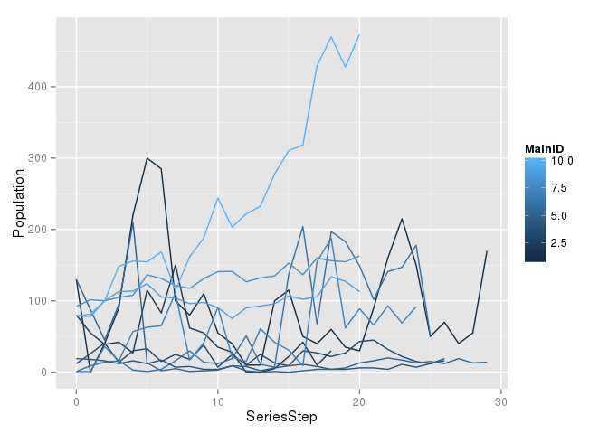

<!-- README.md is generated from README.Rmd. Please edit that file -->
RGPDD
=====

An R interface the [Global Population Dynamics Database](http://www3.imperial.ac.uk/cpb/databases/gpdd)

*Package under development*. Please see the package [issues](/issues) and [milestones](/milestones) for more information.

Background and terms
--------------------

Imperial College, London, Center for Population Biology provides the GPDD in Microsoft Access format available for download without cost after registration with an email address and password. This package aims to streamline the use of this data for R users. At this time the package primarily provides the 9 data tables of the GPDD directly. Helper functions for common operations should be added as time permits, and user contributions are welcome.

Please consult [<http://www3.imperial.ac.uk/cpb/databases/gpdd>](http://www3.imperial.ac.uk/cpb/databases/gpdd) for more information and official documentation of the GPDD data. Documentation from the GPDD is being included as part of the R package documentation where appropriate.

At the time of writing, the GPDD database was last updated in 2010 (v2), see `?gpdd_version`. The original (v1) was published in 1999. Please consider registering for the GPDD and be sure to cite it appropriately:

> "NERC Centre for Population Biology, Imperial College (2010) The Global Population Dynamics Database Version 2. <http://www.sw.ic.ac.uk/cpb/cpb/gpdd.html>".

and notify the database administrator of any publications resulting from this data: <cpb-gpdd-dl@imperial.ac.uk>

The adminstrator has been notified about the existence of the R package project.

Quickstart
----------

Install the package:

``` r
devtools::install_github("ropensci/rgpdd")
```

Load the data and explore the tables.

``` r
library("rgpdd")
library("ggplot2")
library("dplyr")
#> 
#> Attaching package: 'dplyr'
#> 
#> The following object is masked from 'package:stats':
#> 
#>     filter
#> 
#> The following objects are masked from 'package:base':
#> 
#>     intersect, setdiff, setequal, union
```

``` r
ggplot(dplyr::filter(gpdd_data, MainID %in% 1:10)) + geom_line(aes(SeriesStep, Population, col=MainID, group=MainID))
```


